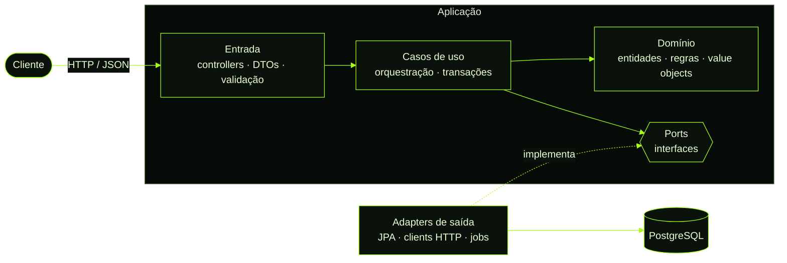

<p align="center">
  
</p>

<p align="center">
  
  
  
  
</p>

<br>


Sou desenvolvedor **back-end** e trabalho principalmente com **Java (Spring Boot)** e **Python (Flask e Django)**.

Gosto de pegar uma regra de negócio confusa e transformar em código que qualquer pessoa do time consegue **ler, testar e evoluir**. Cuido do sistema do começo ao fim: modelo os dados, desenho a API, escrevo os testes, penso na segurança e coloco em produção.

```java
public final class Tutz implements BackendDeveloper {

    @Override
    public Set<String> languages() {
        return Set.of("Java 21", "Python 3");
    }

    @Override
    public Set<String> frameworks() {
        return Set.of("Spring Boot", "Spring Security", "Spring Data JPA", "Flask", "Django");
    }

    @Override
    public List<Principle> principles() {
        return List.of(CLEAN_CODE, EFFECTIVE_JAVA, SOLID, TESTED_BUSINESS_RULES, SECURE_BY_DEFAULT);
    }

    @Override
    public String motto() {
        return "Código é lido muito mais vezes do que é escrito.";
    }
}
```

<br>


| Princípio | Na prática |
| --- | --- |
| **Clean Code** | Nomes que revelam intenção, métodos curtos com uma responsabilidade só, nada de número mágico. Se o código precisa de comentário pra ser entendido, eu reescrevo o código. |
| **Effective Java** | Imutabilidade por padrão (`record`, `final`, `List.copyOf`), static factories e builders, composição em vez de herança, `Optional` só em retorno, `equals`/`hashCode` coerentes e validação que falha cedo. |
| **SOLID** | Injeção por construtor, dependência de abstrações, classes coesas e baixo acoplamento entre módulos. |
| **Testes** | JUnit 5 e Mockito em cima da regra de negócio, testes de integração com banco real e cenários de erro tratados como cidadãos de primeira classe. |
| **API previsível** | REST com recursos bem nomeados, status HTTP corretos, erros padronizados com Problem Details (RFC 9457), paginação e versionamento. |
| **Segurança** | Spring Security, JWT ou sessão com CSRF, senhas com BCrypt, validação na borda, rate limiting e segredos fora do código. |
| **Dados** | Migrações versionadas com Flyway, modelagem pensada nas consultas, índices certos e zero N+1. |

<br>


- **Camadas com fronteiras claras:** entrada, aplicação, domínio e infraestrutura. O domínio não conhece framework.
- **Ports & Adapters** quando o domínio pede; um **monólito modular** bem organizado antes de pensar em microsserviços.
- **DTOs na borda** e mapeamento explícito: entidade nunca vaza pela API.
- **Rotinas agendadas e processamento paralelo** com controle de concorrência e reprocessamento seguro.
- **Multi-tenant** com isolamento de dados por cliente.
- **CI/CD** com GitHub Actions e deploy em VPS Linux com Nginx como proxy reverso.



<br>


<table>
  <tr>
    <td><b>Linguagens</b></td>
    <td>
      
      
      
    </td>
  </tr>
  <tr>
    <td><b>Java</b></td>
    <td>
      
      
      
      
      
    </td>
  </tr>
  <tr>
    <td><b>Python</b></td>
    <td>
      
      
    </td>
  </tr>
  <tr>
    <td><b>Dados</b></td>
    <td>
      
      
    </td>
  </tr>
  <tr>
    <td><b>Testes</b></td>
    <td>
      
      
      
    </td>
  </tr>
  <tr>
    <td><b>Infra</b></td>
    <td>
      
      
      
      
      
    </td>
  </tr>
</table>

<br>


Quer trocar ideia sobre back-end, arquitetura ou um projeto? Me chama:

<p>
  <a href="https://github.com/Tutzdev"></a>
  <!-- Coloque seu LinkedIn e e-mail aqui:
  <a href="https://www.linkedin.com/in/SEU-USUARIO"></a>
  <a href="mailto:SEU@EMAIL.COM"></a>
  -->
</p>

> *"Make it work, make it right, make it fast."* — Kent Beck

<p align="center">
  
</p>
